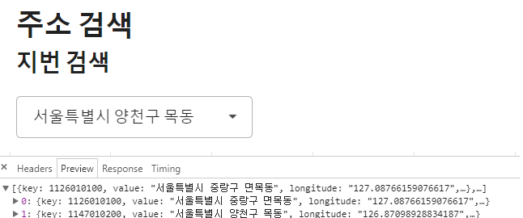

# bbd-feature-searchaddress
지번주소 검색 by using kakao api

The attached CSV data are as of December 11, 2017.
> http://www.mois.go.kr/frt/bbs/type001/commonSelectBoardArticle.do?bbsId=BBSMSTR_000000000052&nttId=60965

This Backend example is compose of **Swagger**, **H2**.
So you can test it at this URL(http://localhost:8080/swagger-ui.html).

This Frontend example used a **React.JS**

---

### UI
 
