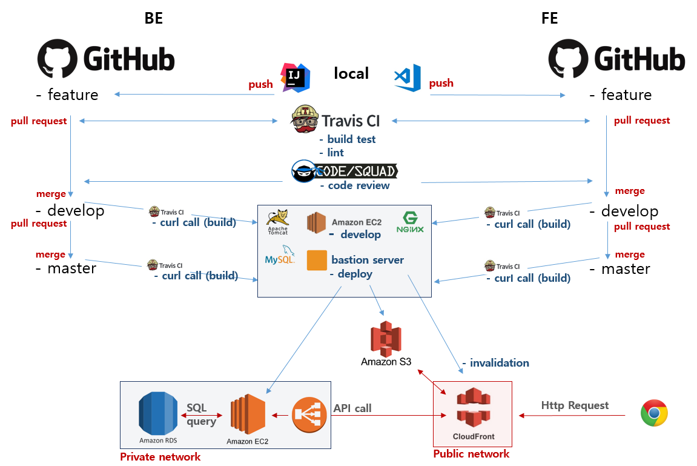

# educhoice-architecture

#### Notice
This example is compose of **Python Server**, **Travis CI**, **Bash Shell Script** and **Slack**.

The work environment consists of **linux(ubuntu/nginx, tomcat, mysql)** and **AWS(EC2, S3, CloudFront, RDS)**.

This example is treating events with **CURL**, but there may be a better architecture to solve the event in **Travis CI**.

---

### Architecture
 

